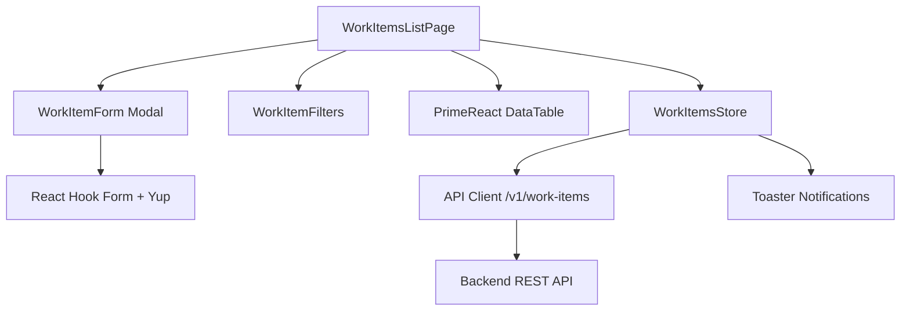

# Technical Design: Platform Activity Management

**Jira Issue:** EPMCDME-65848 
**Feature:** Work Item CRUD with Filters and Sorting 
**Repository:** codemie-ui (React 18.3.1, TypeScript, Vite)

---

## 1. Architecture Overview

This feature introduces a standalone work item management module within the CodeMie platform UI. The architecture follows CodeMie's established patterns: **Valtio** for reactive state management, **React Hook Form** with **Yup** for form validation, and **PrimeReact DataTable** for the list view.

The module consists of a dedicated Valtio store (`workItems.ts`) managing work item state and API interactions, a list page (`WorkItemsListPage.tsx`) with integrated filtering and sorting controls, and a reusable form component (`WorkItemForm.tsx`) for create and edit operations. The store encapsulates all async operations using the custom fetch wrapper (`@/utils/api`), ensuring consistent error handling with automatic toaster notifications.

All work items are persisted via RESTful backend APIs. The UI never manipulates data directly; all state mutations flow through store actions that trigger API calls, ensuring a single source of truth. The component hierarchy remains flat, with custom hooks extracted when logic exceeds 50 lines, following CodeMie's 300-line-per-file guideline.



---

## 2. High-Level Design

### 2.1 Components

| Component | Responsibility |
|----------|----------------|
| **WorkItemsStore** (`src/store/workItems.ts`) | Valtio store managing work items array, filters, pagination, loading states; exposes actions: `fetchWorkItems()`, `createWorkItem()`, `updateWorkItem()`, `deleteWorkItem()`, `setFilters()`, `setSort()` |
| **WorkItemsListPage** (`src/pages/work-items/WorkItemsListPage.tsx`) | Main page rendering DataTable, filter controls, "Create" button; subscribes to store; handles row actions (edit, delete) |
| **WorkItemForm** (`src/pages/work-items/WorkItemForm.tsx`) | Dialog modal for create/edit; uses React Hook Form with Yup schema; controlled by `isOpen` prop; emits `onSave` callback |
| **WorkItemFilters** (`src/pages/work-items/WorkItemFilters.tsx`) | Dropdown controls for Type, Priority, Status; updates store filters on change |
| **formSchema.ts** (`src/pages/work-items/formSchema.ts`) | Yup validation schema: title required (max 200), type/priority/status enums, optional assignee and tags |
| **StatusBadge** (`src/pages/work-items/StatusBadge.tsx`) | Renders color-coded status pill (Open: blue, InProgress: yellow, Done: green, Closed: gray) |
| **PriorityIcon** (`src/pages/work-items/PriorityIcon.tsx`) | Icon representation of priority (Critical: red exclamation, High: orange, Medium: yellow, Low: gray) |

### 2.2 State Management (Valtio Store)

```typescript
// src/store/workItems.ts
interface WorkItemsState {
  items: WorkItem[];
  filters: { type?: string; priority?: string; status?: string };
  sort: { field: string; order: 'asc' | 'desc' };
  loading: boolean;
  total: number;
  page: number;
  pageSize: number;
}
```

Actions:
- `fetchWorkItems()` - calls `GET /v1/work-items` with current filters/sort/pagination
- `createWorkItem(data)` - calls `POST /v1/work-items`, appends to `items`, shows success toaster
- `updateWorkItem(id, data)` - calls `PUT /v1/work-items/:id`, updates item in `items`, shows success toaster
- `deleteWorkItem(id)` - calls `DELETE /v1/work-items/:id`, removes from `items`, shows success toaster
- `setFilters(filters)` - updates filters, resets to page 1, calls `fetchWorkItems()`
- `setSort(field, order)` - updates sort, calls `fetchWorkItems()`

---

## 3. Low-Level Design

### 3.1 API Contracts

#### GET /v1/work-items

**Method:** GET  
**Query Params:** `type`, `priority`, `status`, `sort` (field name), `order` (asc|desc), `page`, `pageSize`  
**Response:**

```json
{
  "items": [
    {
      "id": "wi-123",
      "title": "Fix login bug",
      "description": "Users cannot log in after password reset",
      "type": "Bug",
      "priority": "High",
      "status": "Open",
      "assignee": "user-456",
      "tags": ["auth", "urgent"],
      "createdAt": "2025-01-15T10:30:00Z",
      "updatedAt": "2025-01-15T10:30:00Z"
    }
  ],
  "total": 42,
  "page": 1,
  "pageSize": 20
}
```

#### POST /v1/work-items

**Method:** POST  
**Request Body:**

```json
{
  "title": "Implement SSO integration",
  "description": "Add support for SAML and OAuth2",
  "type": "Feature",
  "priority": "Medium",
  "status": "Open",
  "assignee": "user-789",
  "tags": ["security", "integration"]
}
```

**Response:** Created work item object (201 status)

#### PUT /v1/work-items/:id

**Method:** PUT  
**Request Body:** Same as POST (partial updates supported)  
**Response:** Updated work item object (200 status)

#### DELETE /v1/work-items/:id

**Method:** DELETE  
**Response:** 204 No Content

### 3.2 Data Model

**TypeScript Interface** (`src/types/entity/workItem.ts`):

```typescript
export type WorkItemType = 'Task' | 'Bug' | 'Feature';
export type WorkItemPriority = 'Low' | 'Medium' | 'High' | 'Critical';
export type WorkItemStatus = 'Open' | 'InProgress' | 'Done' | 'Closed';

export interface WorkItem {
  id: string;
  title: string;
  description?: string;
  type: WorkItemType;
  priority: WorkItemPriority;
  status: WorkItemStatus;
  assignee?: string;
  tags?: string[];
  createdAt: string;
  updatedAt: string;
}
```

**Validation Schema** (`src/pages/work-items/formSchema.ts`):
- `title`: required, string, max 200 characters
- `type`: required, one of ['Task', 'Bug', 'Feature']
- `priority`: required, one of ['Low', 'Medium', 'High', 'Critical']
- `status`: required, one of ['Open', 'InProgress', 'Done', 'Closed']
- `assignee`: optional string
- `tags`: optional array of strings

---

## 4. UI Wireframe Description

### List Screen (`/work-items`)

**Header:**
- Title: "Work Items"
- Button: "+ Create Work Item" (top-right, opens form modal)

**Filter Bar (horizontal):**
- Dropdown: "Type" (All / Task / Bug / Feature)
- Dropdown: "Priority" (All / Low / Medium / High / Critical)
- Dropdown: "Status" (All / Open / InProgress / Done / Closed)
- Button: "Clear Filters"

**Data Table (PrimeReact DataTable):**

| Title (sortable) | Type | Priority (sortable) | Status | Assignee | Tags | Created (sortable) | Updated (sortable) | Actions |
|-----------------|------|---------------------|--------|----------|------|-------------------|--------------------|---------|
| Fix login bug | Bug | High (orange icon) | Open (blue badge) | John Doe | auth, urgent | Jan 15, 2025 | Jan 15, 2025 | Edit / Delete |

**Footer:**
- Pagination controls (rows per page: 10/20/50, page navigation)

### Create/Edit Form Modal

**Modal Title:** "Create Work Item" or "Edit Work Item"  
**Form Fields (vertical layout):**

1. **Title*** (text input, max 200 chars)
2. _Description_ (textarea, optional)
3. **Type*** (dropdown: Task / Bug / Feature)
4. **Priority*** (dropdown: Low / Medium / High / Critical)
5. **Status*** (dropdown: Open / InProgress / Done / Closed)
6. _Assignee_ (dropdown or autocomplete, optional)
7. _Tags_ (multi-select or chip input, optional)

**Footer Buttons:**
- "Cancel" (closes modal, no save)
- "Save" (validates, submits, closes on success)

---

**End of Design Document**